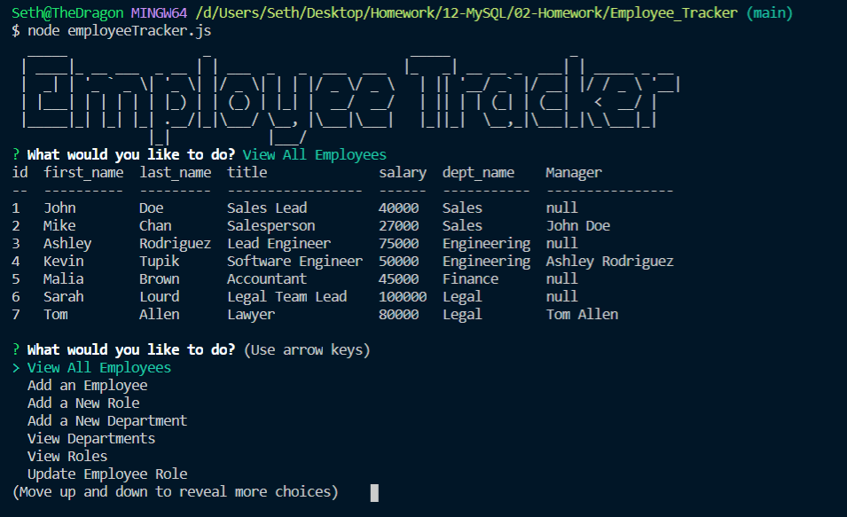

#  **Employee_Tracker**

  

  ## Application Description:
  > *This backend application allows a user to manage their employee database. A user can view and add employees, roles, and departments, as well as update an employee's role and remove employees from the database. All of these functions are displayed in the terminal.*

  Below is a picture of the Application:
  
  

  ## Table of Contents:

  * [Project Description](#description)
  * [Installation Process](#installation)
  * [Usage](#usage)
  * [How to Contribute](#contribution)
  * [License](#license)
  * [Questions](#questions)
  * [Creator Information](#creator)

  ## Installation:
  > *To install, please run "npm i" in your terminal to download the proper inquirer and mysql dependancies.*

  ## Usage:
  > *To properly use this repo, ensure that all dependancies are installed, and then run "node employeeTracker.js" in your terminal to start the program.*

  ## Contribution:
  > *Contributions are welcome! Please ensure that you are editting in branches and submit pull requests with your adjustments.*

  ## License:
  > *Apache 2.0*

  ## Questions:
  If you have questions, please reach out using the following link
  >[GitHub Profile](http://github.com/Seth-hulsmeyer)

  ## Creator:
  * **Name:** Seth Hulsmeyer
  * **GitHub Username:** Seth-hulsmeyer
  * **Email:** seth.hulsmeyer@hotmail.com

